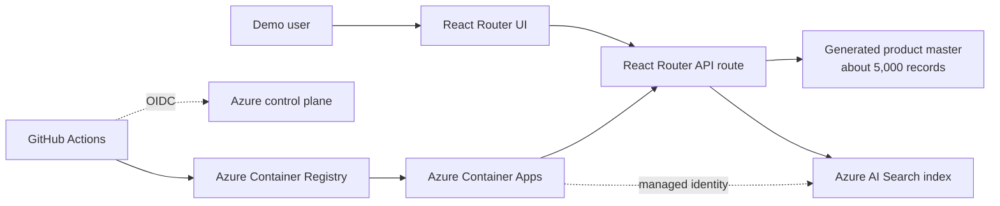

# Product Master Search Demo

Microsoft のお客様向けデモで利用することを想定した、Azure AI Search による食品の商品マスタ検索アプリです。約 5,000 件の架空の商品マスタを Azure AI Search に同期し、React Router + Fluent UI の画面からインクリメンタル検索できます。

> このリポジトリはデモ用途のサンプルです。実データ、個人情報、顧客固有情報は含みません。本番導入時は、データ更新方式、ネットワーク制御、監査、可用性、権限分離などをお客様要件に合わせて設計してください。

## このデモで示すこと

- 商品名、カナ、ブランド、カテゴリ、タグ、商品コードを横断したフルテキスト検索
- `トマト`、`有機`、`カレー`、`FD-DRK` のような日本語/コード検索
- 約 5,000 件の商品マスタを Azure AI Search に登録し、検索結果を最大 100 件までテーブル表示
- Azure Container Apps 上のアプリから Managed Identity で Azure AI Search にアクセスする passwordless 構成
- GitHub Actions の OIDC 認証によるタグベース CD

## Live demo

現在のデモ環境:

https://ca-product-search-demo-rbwwno.braveriver-06d53d2c.japaneast.azurecontainerapps.io/

デモで使いやすい検索語:

| 検索語 | 目的 |
| --- | --- |
| `トマト` | 商品名/説明文に含まれる日本語検索 |
| `有機` | タグや商品名に含まれる属性検索 |
| `カレー` | レトルトカテゴリの食品検索 |
| `FD-DRK` | ハイフン付き商品コードの prefix 検索 |
| 空文字 | おすすめ/初期表示として最大 100 件を表示 |

## ドキュメント

| Document | 内容 |
| --- | --- |
| [Customer demo guide](docs/customer-demo-guide.md) | お客様デモの事前準備、話すポイント、操作シナリオ、想定 Q&A |
| [Architecture and operations](docs/architecture-and-operations.md) | アーキテクチャ、Azure リソース、認証/RBAC、CI/CD、運用メモ |

## アーキテクチャ概要



## 技術スタック

| 領域 | 実装 |
| --- | --- |
| Frontend | React Router framework mode, React 19, Fluent UI React v9 |
| Styling | CSS Modules |
| Backend | React Router server route for `/api/products/search` |
| Search | Azure AI Search, Japanese analyzer, scoring profile, code-search helper field |
| Product master | 約 5,000 件の deterministic TypeScript generator |
| Hosting | Azure Container Apps |
| Image registry | Azure Container Registry |
| App authentication | Container Apps system-assigned Managed Identity |
| CI/CD authentication | GitHub Actions OIDC to Microsoft Entra ID |
| Infrastructure | Bicep and Azure Developer CLI-compatible layout |

## リポジトリ構成

```text
app/
  components/product-search/           # Fluent UI + CSS Modules search UI
  lib/client/                          # Browser-side API client and search state
  lib/domain/                          # Product entity, repository port, value objects
  lib/server/                          # Search use cases and Azure AI Search adapter
  routes/                              # React Router pages and API routes
infra/
  main.bicep                           # Subscription-scope resource group deployment
  modules/                             # ACR, Container Apps, AI Search, monitoring, RBAC
.github/workflows/
  ci.yml                               # Pull request/main validation
  cd.yml                               # Tag-based deployment to Azure Container Apps
docs/
  customer-demo-guide.md
  architecture-and-operations.md
```

## ローカル開発

前提:

- Node.js 22
- Docker Desktop または互換 container runtime
- Azure CLI
- Microsoft Entra ID 経由での Azure AI Search アクセス

```bash
npm ci
cp .env.example .env
npm run dev
```

`.env`:

```env
AZURE_SEARCH_ENDPOINT=https://<search-service-name>.search.windows.net
AZURE_SEARCH_INDEX_NAME=products
```

ローカルでは `DefaultAzureCredential` を使うため、アプリ起動前に Azure CLI で sign in します。

```bash
az login
```

確認に使うコマンド:

```bash
npm run typecheck
npm run build
docker build --pull --tag product-master-search-demo:local .
az bicep build --file infra/main.bicep --stdout > /dev/null
```

## Azure deployment model

このデモは Azure Container Apps にデプロイされており、次の Azure サービスを使います。

- Azure Container Registry
- Azure Container Apps
- Azure AI Search
- Log Analytics workspace
- Application Insights
- Managed Identity and Azure RBAC

Infrastructure は `infra/` で定義しています。アプリケーション container は `Dockerfile` から build し、GitHub Actions CD でデプロイします。

## CI/CD

### CI

Pull request と `main` への push で実行します。

1. `npm ci`
2. `npm run typecheck`
3. `npm run build`
4. `docker build`
5. `az bicep build`

### CD

`v*.*.*` tag の push または manual workflow dispatch で実行します。

1. GitHub Actions OIDC で Azure に認証する。
2. Azure Container Registry に login する。
3. tag 付き container image を build/push する。
4. Azure Container Apps を新しい image に更新する。
5. `/api/health` を確認する。

Release 例:

```bash
git tag -a v0.3.2 -m "v0.3.2"
git push origin v0.3.2
```

## GitHub OIDC configuration

CD は client secret ではなく GitHub Actions OIDC を使います。GitHub Environment は `production` で、Entra Federated Credential subject は次の形式です。

```text
repo:piroyoung/product_master_example:environment:production
```

Production environment variables:

| Name | 用途 |
| --- | --- |
| `AZURE_CLIENT_ID` | Entra application client ID for GitHub Actions OIDC |
| `AZURE_TENANT_ID` | Azure tenant ID |
| `AZURE_SUBSCRIPTION_ID` | Azure subscription ID |
| `AZURE_RESOURCE_GROUP` | Target resource group |
| `AZURE_CONTAINER_REGISTRY_NAME` | ACR resource name |
| `AZURE_CONTAINER_REGISTRY_LOGIN_SERVER` | ACR login server |
| `AZURE_CONTAINER_APP_NAME` | Container App resource name |
| `AZURE_CONTAINER_APP_FQDN` | Container App FQDN |
| `IMAGE_NAME` | Container image repository name |

デモ CD identity の RBAC は、必要な scope に絞っています。

| Scope | Role |
| --- | --- |
| Resource group | Reader |
| Azure Container Registry | AcrPush |
| Azure Container App | Container Apps Contributor |

## 商品マスタと indexing

デモ商品マスタは `app/lib/server/infrastructure/repositories/static-product-repository.ts` で生成します。

- 件数: 5,000 products
- カテゴリ: 飲料、米・穀物、麺類、調味料、冷凍食品、菓子・ナッツ、缶詰、乳製品、パン、レトルト
- Fields: product code, name, kana, brand, category, tags, allergens, price, package size, description, updated date
- Public demo で扱える deterministic な架空データ

アプリ instance の初回検索時:

1. Azure AI Search index が存在することを確認する。
2. 商品 document を 1,000 件単位で upload する。
3. 同期結果を process 内に cache する。
4. 検索 request は Azure AI Search に query し、最大 100 rows を返す。

## Security posture

- No database passwords or search keys in application code
- Azure AI Search local auth is disabled in infrastructure
- Container Apps uses Managed Identity for Azure AI Search access
- ACR admin user is disabled
- GitHub Actions CD uses OIDC and environment-scoped federated credentials
- CI/CD permissions are least-privilege for the current deployment path

## Customization points

| 目的 | 変更箇所 |
| --- | --- |
| Add or change demo products | `static-product-repository.ts` |
| Change searchable fields or scoring | `azure-search-product-gateway.ts` |
| Change result columns | `ProductResultList.tsx` and `ProductResultList.module.css` |
| Change result limit | `fetchProductSearch()` and `normalizeTop()` |
| Add filters/facets | AI Search index fields, API route, client state, UI controls |
| Replace generated master with real source | Implement `ProductRepository` with database/API/storage adapter |

## 本番化に向けた検討事項

お客様実装では、次の論点を確認します。

- Source of truth for product master data
- Incremental indexing strategy from the source system
- Private networking and egress restrictions
- Multi-region availability and disaster recovery
- Search relevance tuning, synonyms, facets, semantic ranking, and vector/hybrid search
- Observability, alerting, SLOs, and audit requirements
- Data classification and compliance requirements
