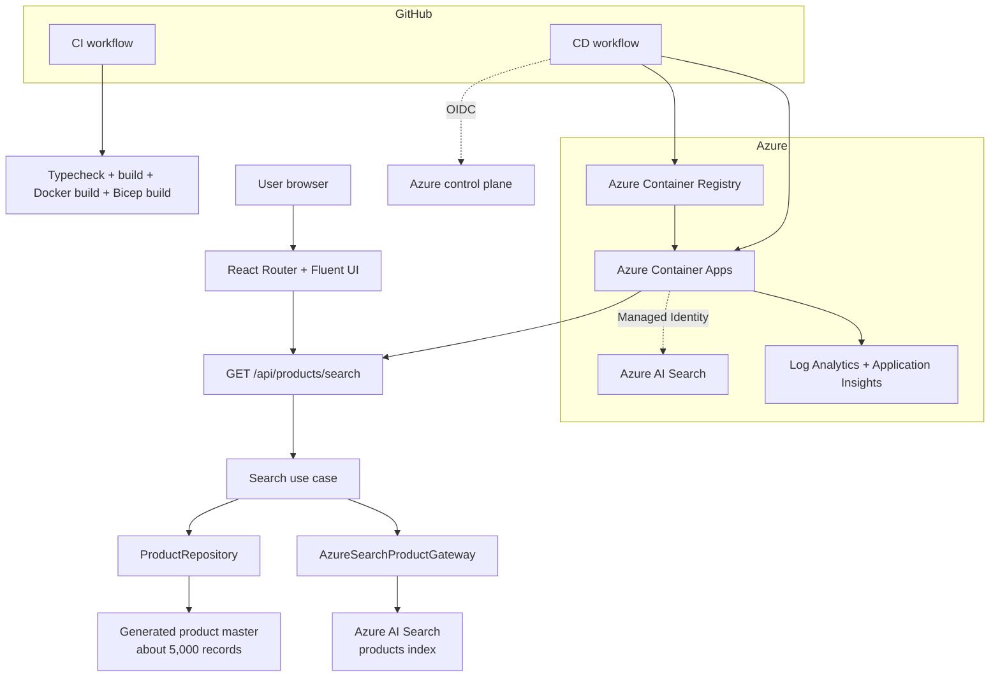

# アーキテクチャと運用ガイド

このドキュメントは、デモアプリの構成、Azure リソース、認証/RBAC、CI/CD、運用・拡張ポイントを説明します。お客様向け説明や、社内での引き継ぎに使うことを想定しています。

## 論理アーキテクチャ



## 実行時の検索フロー

1. ブラウザーが `/api/products/search?q=<query>&top=100` を呼び出す。
2. API route が検索語と取得件数を正規化する。
3. Search use case が Azure AI Search の index を準備する。
4. Product repository が約 5,000 件の生成商品マスタを返す。
5. Gateway が商品ドキュメントを 1,000 件単位で Azure AI Search に upsert する。
6. 同期結果はアプリプロセス内で cache され、検索リクエストごとの全件再登録を避ける。
7. Gateway が Azure AI Search に query を実行する。
8. UI が検索結果をテーブル表示する。

## Search index 設計

Search index は `app/lib/server/infrastructure/gateways/azure-search-product-gateway.ts` で定義しています。

| Field | 役割 |
| --- | --- |
| `id` | key field |
| `code` | 商品コード。searchable/filterable/sortable |
| `codeSearch` | ハイフンを含むコード検索を扱いやすくする hidden helper field |
| `name` | 商品名。Japanese analyzer |
| `kana` | 商品名カナ。Japanese analyzer |
| `brand` | ブランド。searchable/filterable/facetable |
| `category` | カテゴリ。searchable/filterable/facetable |
| `tags` | 商品属性。searchable/filterable/facetable |
| `allergens` | アレルゲン。filterable/facetable |
| `price` | 価格。filterable/sortable |
| `packageSize` | 規格。searchable |
| `description` | 説明文。Japanese analyzer |
| `updatedAt` | 更新日時。filterable/sortable |

Scoring profile では、次の field を強めています。

- `name`
- `code`
- `codeSearch`
- `kana`
- `tags`

これにより、商品名や商品コードの検索を優先しつつ、タグや説明文も検索対象にできます。

## 商品マスタ生成

商品マスタは `app/lib/server/infrastructure/repositories/static-product-repository.ts` で生成しています。

設計意図:

- 外部 DB に依存せずにデモを再現できる。
- 顧客データや個人情報を含めない。
- ローカルと Azure で同じデータを生成できる。
- 検索デモに十分な件数とバリエーションを持たせる。
- 商品コード prefix が説明しやすい。

現在の生成モデル:

- 10 カテゴリ
- 1 カテゴリあたり 500 件
- 合計 5,000 件
- `北海道産`, `有機`, `業務用`, `季節限定` などのバリエーション
- アレルゲン、規格、価格、タグ、ブランド、説明文を含む

## Azure リソース

| Resource | デモでの役割 |
| --- | --- |
| Azure Container Apps | React Router server app と静的 asset をホスト |
| Azure Container Registry | GitHub Actions CD が作成した container image を保存 |
| Azure AI Search | 商品検索 index を保存し query を実行 |
| Log Analytics | Container Apps logs を収集 |
| Application Insights | アプリ監視の接続先 |
| Managed Identity | 実行中アプリから Azure AI Search へアクセス |
| Azure RBAC | アプリと CD identity に最小権限を付与 |

## 認証と認可

### アプリから Azure AI Search

`azure-credential.server.ts` で実行環境に応じて credential を選択します。

- Azure-hosted runtime: `ManagedIdentityCredential`
- Local development: `DefaultAzureCredential`

Infrastructure では Azure AI Search の local auth を無効化し、Container App の system-assigned Managed Identity に必要な RBAC を付与します。

- Search Service Contributor
- Search Index Data Contributor

### GitHub Actions から Azure

CD は Microsoft Entra ID の app registration と GitHub Actions OIDC を使います。Federated Credential は GitHub の `production` environment に scope しています。

```text
repo:piroyoung/product_master_example:environment:production
```

CD 用 service principal の RBAC は、現在のデプロイ経路に必要な範囲に限定しています。

| Scope | Role |
| --- | --- |
| Resource group | Reader |
| Azure Container Registry | AcrPush |
| Azure Container App | Container Apps Contributor |

GitHub には Azure client secret を保存しません。

## CI/CD 運用

### CI workflow

File: `.github/workflows/ci.yml`

Trigger:

- Pull request
- Push to `main`

Validation:

- `npm ci`
- `npm run typecheck`
- `npm run build`
- `docker build`
- `az bicep build`

### CD workflow

File: `.github/workflows/cd.yml`

Trigger:

- `v*.*.*` に一致する tag push
- Manual workflow dispatch

Deployment:

1. OIDC で Azure に login。
2. ACR に login。
3. Git tag を image tag として container image を build。
4. ACR に image を push。
5. Container Apps の image を更新。
6. `/api/health` を確認。

## 設定値

Runtime environment variables:

| Name | Required | Description |
| --- | --- | --- |
| `NODE_ENV` | Yes | Azure では `production` |
| `PORT` | Yes | Container listener port。現在は `3000` |
| `AZURE_SEARCH_ENDPOINT` | Yes | Azure AI Search endpoint |
| `AZURE_SEARCH_INDEX_NAME` | Yes | Search index name。現在は `products` |
| `APPLICATIONINSIGHTS_CONNECTION_STRING` | Optional | Monitoring connection string |
| `AZURE_CLIENT_ID` | Optional | User-assigned managed identity を使う場合の client ID |

Local `.env.example`:

```env
AZURE_SEARCH_ENDPOINT=https://<search-service-name>.search.windows.net
AZURE_SEARCH_INDEX_NAME=products
```

## よく使う運用コマンド

### ローカル起動

```bash
npm ci
cp .env.example .env
az login
npm run dev
```

### push 前の確認

```bash
npm run typecheck
npm run build
docker build --pull --tag product-master-search-demo:local .
az bicep build --file infra/main.bicep --stdout > /dev/null
```

### 新しい version を release

```bash
git tag -a v0.3.2 -m "v0.3.2"
git push origin v0.3.2
```

### デプロイ済みアプリの確認

```bash
BASE_URL="https://ca-product-search-demo-rbwwno.braveriver-06d53d2c.japaneast.azurecontainerapps.io"
curl --fail --silent --show-error "$BASE_URL/api/health"
curl --fail --silent --show-error --get "$BASE_URL/api/products/search" \
  --data-urlencode "q=トマト" \
  --data-urlencode "top=100"
```

期待値:

- `indexedCount` が `5000`
- `items.length` が最大 `100`
- 結果に商品コード、商品名、ブランド、カテゴリ、タグ、アレルゲン、規格、価格、score が含まれる

## Troubleshooting

| 症状 | 主な原因 | 確認ポイント |
| --- | --- | --- |
| Search API が 500 を返す | Managed Identity または AI Search RBAC の問題 | Container App identity の Azure AI Search role assignment |
| 検索結果が少ない | query が絞り込まれている、または `top` が小さい | request query string と API response |
| 商品コード検索が期待通りでない | index schema または `codeSearch` field の変更 | index definition と document upload |
| CD が Azure に login できない | OIDC Federated Credential の subject 不一致 | subject、environment name、client ID、tenant ID |
| CD が image を push できない | ACR role 不足 | target registry の AcrPush |
| CD が Container Apps を更新できない | Container Apps role 不足 | target app の Container Apps Contributor |
| 初回検索が遅い | index 作成/アップロードが初回に走っている | デモでは想定内。本番では indexing pipeline へ分離 |

## 本番化に向けた検討リスト

お客様実装では、次を検討してください。

- 生成データを実際の source of truth connector に置き換える。
- indexing を検索リクエストから分離し、スケジュール実行またはイベント駆動にする。
- category、brand、price range、allergen などの facet/filter を追加する。
- synonym map で商品名の表記揺れに対応する。
- semantic ranker や vector/hybrid search の適用可能性を評価する。
- 必要に応じて Private Endpoint、VNet integration、egress control を設計する。
- search latency、result count、zero-result query などの custom telemetry を追加する。
- data retention、backup、DR、compliance control を定義する。
- dev/test/prod の subscription または resource group を分離する。
- GitHub `production` environment に approval gate を設定する。
